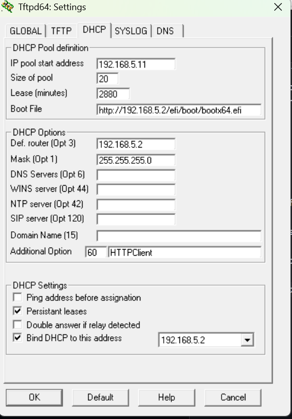

1. Download a copy of TFTPD64 - [https://github.com/PJO2/tftpd64](https://github.com/PJO2/tftpd64)
2. Run and open "Settings"
2. Under the "DHCP" tab set

    * IP pool start address = This should be in the same subnet as your server

    * IP pool size = At least as large as the number of clients

    * Default router = Appropriate router such as 192.168.1.1 or 192.168.1.254

    * Mask = Correct mask for network such as 255.255.255.0

    * Boot file = http://SERVERIP/BOOTFILEURL 

    * Additional option - 60 = HTTPClient

It should look like the below but with your own values.
