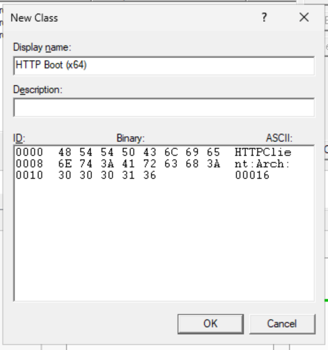
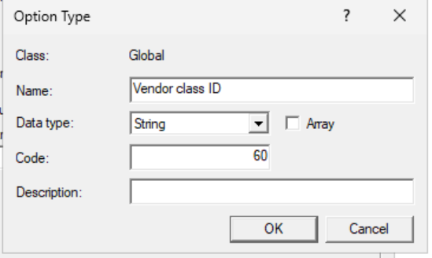
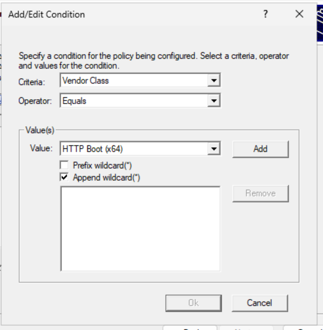
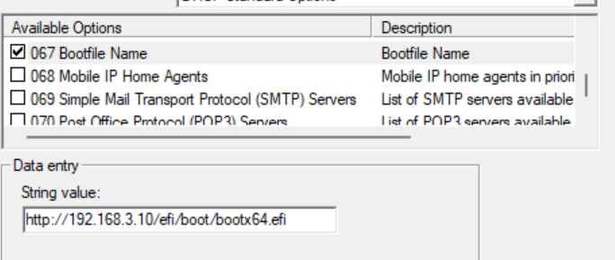
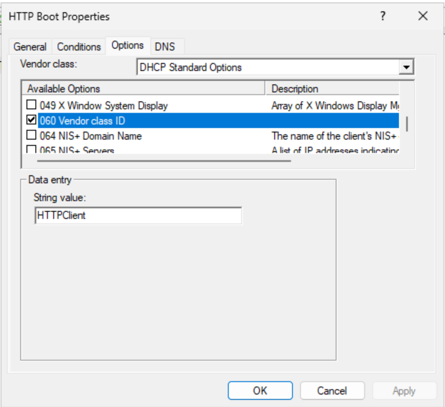

# Windows Server DHCP Setup
This assumes you have a working DHCP server and scope and just need to add HTTP Boot Support

## Setup
### Vendor class
Create a new vendor class for the HTTP client, we will use this to filter the options to only send over the boot parameter when there is HTTP booting.

1. Right click on IPv4 / IPv6 and click on "Define Vendor Classes"
1. Click "Add"
    1. For display name enter in something like "HTTP Boot (x64)"
    1. For ASCII enter in 
        `HTTPClient:Arch:00016:`
    1. "OK"

### Add boot file predefined option
1. Right click on IPv4 and click on "Set predefined options"
1. Select the "DHCP standard options" vendor class in the top dropdown
1. Add a new identifier
    1. Call it "Vendor class identifier"
    1. Set the code to 60
    1. Set the type to string
    

### Policy
1. Create a new Policy
1. Name it descriptively like "HTTP Boot"
1. Add a Condition for vendor class with the HTTP Boot (X64) and append a wildcard

1. Under the DHCP Standard Options, check option 67 and enter in the server boot address with boot file name such as `http://192.168.3.10/efi/boot/bootx64.efi`

1. Under the "DHCP standard options" vendor class, check the box for 060 and set it to `HTTPClient`

1. Finish