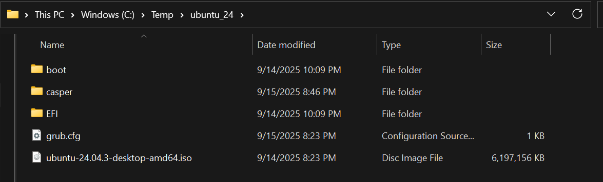

# Parameters for DHCP
 - Boot File URL = `efi/boot/bootx64.efi`

Custom setup is required, the disk alone will not suffice. 

This boot method will not work with the python webserver as grub depends on keep alive support.

# OS Setup
## Get source files
1. Download the latest ubuntu ISO
1. Mount the ISO and copy the folders "boot" and "EFI"  to a folder on your machine - this can be somewhere like `C:\inetpub\ubuntu` or `/var/srv/ubuntu`. I'll refer to this as the serve root in the guide.
1. Copy the boot\grub\grub.cfg to the serve root
1. Copy the Ubuntu ISO to the serve root
1. Edit the grub.cfg to match [the sample grub.cfg](ubuntu/grub.cfg). Replace the SERVERIP with the servers IP and ISOFILE.iso with the ISO path.

You should now have a setup like the below:

## Making a custom ISO for booting 
See https://github.com/PJ-Singh-001/Cubic